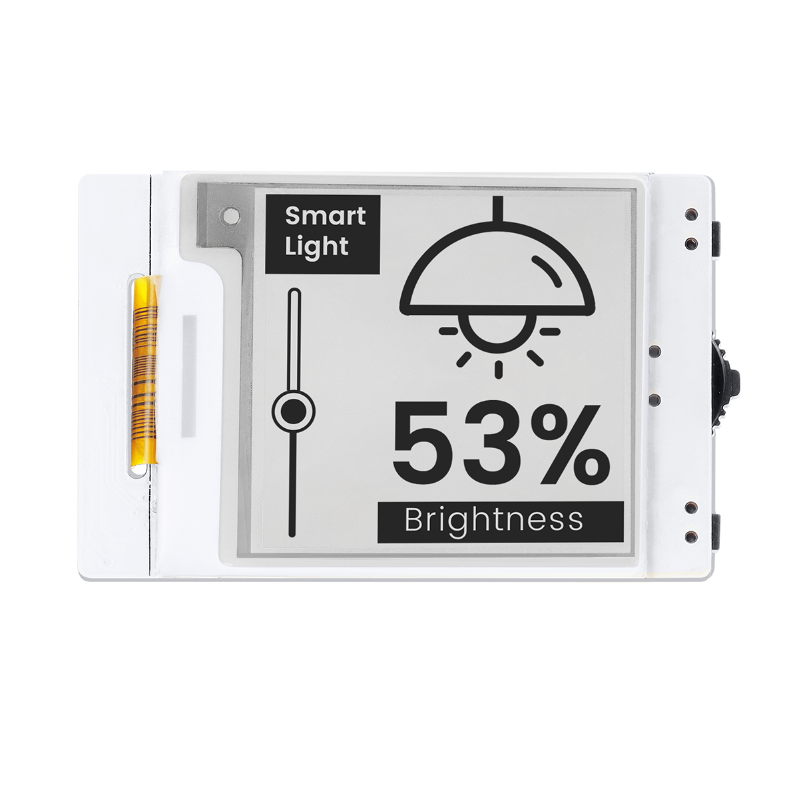
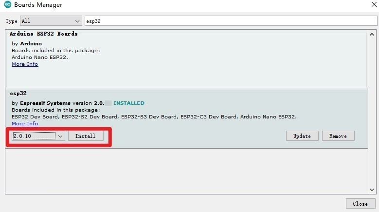

### 1, Product picture

### 2, Product version number

|      | Hardware | Software | Remark |
| ---- | -------- | -------- | ------ |
| 1    | V1.0     | V1.0     | latest |

### 3, product information

#### Display Module Specifications

- Size: 1.54 inch
- MCU: ESP32-S3, up to 240 MHz
- Flash: 8 MB
- PSRAM: 8 MB
- Material: Active Matrix Electrophoretic Display (AM EPD)
- Driver Chip: SSD1680
- Resolution: 128(H)*296(V) Pixel
- Pixel pitch: 0.227*0.226
- Viewing Angle: Full Viewing Angle
- Communication interface: 3-/4-wire SPI
- Interface: UART0 x1, BAT x1
- Button: Dial Switch x1, Menu Button x1, Back Button x1, REST Button x1, BOOT Button x1
- Development Environment: Arduino IDE、ESP IDF、MicroPython
- Display Color: Black and white
- Refresh Mode: Partial refresh (saves more power)
- Display Operation Voltage: 2.2~3.7V
- Acrylic Case: White Acrylic Case
- Operation Temperature: -0~50℃
- Storage Temperature: -25~70℃
- Active Area: 37.18(H)\*48.32(L) (H*L)

### 4, Use the driver module

| Name    | dependency library     |
| ------- | ---------------------- |
| SSD1680 | EPD version=1.0.0 |

### 5,Quick Start

##### Arduino IDE starts

1.Download the library files used by this product to the 'libraries' folder.

C:\Users\Documents\Arduino\libraries\

2.Open the Arduino IDE

3.Open the code configuration environment and burn it

### 6,Folder structure.

|--3D file： Contains 3D model files (.stp) for the hardware. These files can be used for visualization, enclosure design, or integration into CAD software.

|--Datasheet: Includes datasheets for components used in the project, providing detailed specifications, electrical characteristics, and pin configurations.

|--Eagle_SCH&PCB: Contains **Eagle CAD** schematic (`.sch`) and PCB layout (`.brd`) files. These are used for circuit design and PCB manufacturing.

|--example: Provides example code and projects to demonstrate how to use the hardware and libraries. These examples help users get started quickly.

|--factory_firmware: Stores pre-compiled factory firmware that can be directly flashed onto the device. This ensures the device runs the default functionality.

|--factory_sourcecode: Contains the source code for the factory firmware, allowing users to modify and rebuild the firmware as needed.

### 7,Pin definition

#define SCK 12

#define MOSI 11

#define RES 10

#define DC 13

#define CS 14

#define BUSY 9